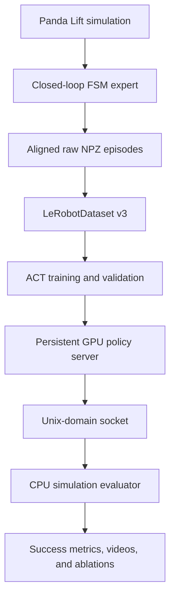
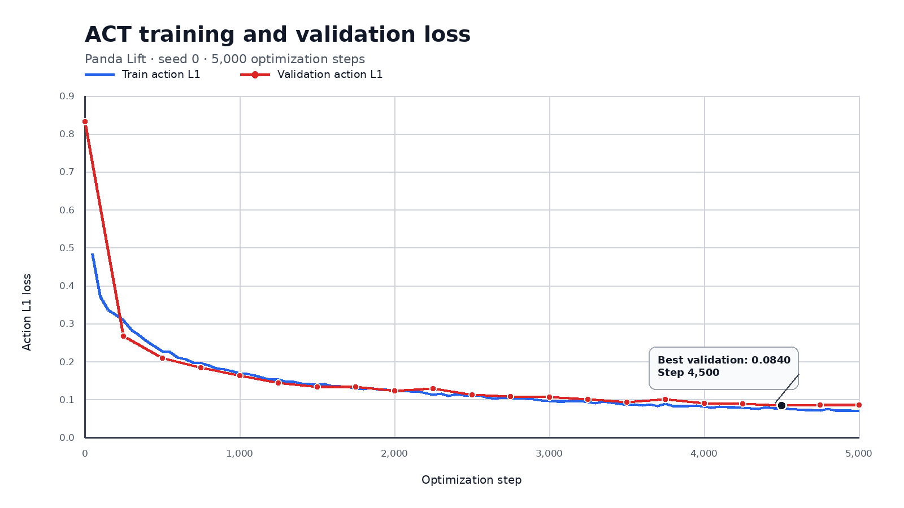

# Vision-Based Imitation Learning for Robotic Manipulation

An end-to-end visual imitation-learning system for Franka Panda manipulation,
built with LeRobot, robosuite, and MuJoCo.

The project covers the complete pipeline from scripted expert demonstrations
to ACT training, cross-environment policy serving, closed-loop evaluation,
paired ablation experiments, and failure analysis.

## Results

The trained ACT policy was evaluated on 50 unseen Panda Lift initializations
using seeds 1000–1049.

| Execution horizon | Success rate | Mean episode steps | Policy requests/episode |
|---:|---:|---:|---:|
| 1 action | 28/50 (56%) | 188.06 | 188.06 |
| 5 actions | 39/50 (78%) | 135.92 | 27.58 |
| 20 actions | **44/50 (88%)** | **103.88** | **5.48** |

The default 20-action execution horizon achieved the highest success rate and
lowest online inference demand. Paired McNemar tests showed that one-step
replanning was significantly worse than both five-step and twenty-step
execution.

See [`docs/action_chunk_ablation.md`](docs/action_chunk_ablation.md) for
confidence intervals, paired seed comparisons, clipping diagnostics, and
statistical interpretation. The raw training and paired evaluation CSVs are
available under [`results/`](results/).

## System overview



Two Python environments are intentionally used:

- The simulation environment contains robosuite, MuJoCo, and NumPy 1.26.
- The training environment contains LeRobot, PyTorch, and NumPy 2.x.

A small Unix-domain socket protocol connects the CPU simulation process to the
persistent GPU ACT policy process. This isolates incompatible dependencies
without serializing images through files or repeatedly loading the model.

## Task definition

The current task is Panda Lift:

- Robot: Franka Panda
- Simulator: robosuite 1.5.2 on MuJoCo 3.3.0
- Camera: `sideview`
- RGB observation: `96 × 96`
- Proprioceptive state: 12 dimensions
- Action: 3D end-effector delta plus gripper command
- Control frequency: 20 Hz
- Maximum episode length: 300 steps
- Success: lift the cube 8 cm above its initial height and maintain the
  condition for 10 consecutive control steps

The default ACT configuration uses a 20-step action chunk and executes all 20
predicted actions before replanning.

## Dataset

A deterministic closed-loop finite-state-machine expert generates successful
demonstrations:

| Split | Seeds | Successful episodes |
|---|---:|---:|
| Train | 0–99 | 100 |
| Validation | 100–119 | 20 |
| Closed-loop test | 1000–1049 | 50 policy rollouts |

Raw episodes preserve aligned tuples of `observation_t`, `action_t`, and
`next_observation_t`. Only successful, validated episodes are converted to
LeRobotDataset v3.

The converted policy schema is:

| Feature | Shape |
|---|---:|
| `observation.images.front` | `(3, 96, 96)` |
| `observation.state` | `(12,)` |
| `action` | `(4,)` |

## Training result

The baseline ACT experiment used:

- 5,000 optimization steps
- Batch size 32
- Random seed 0
- Complete validation every 250 steps
- Checkpointing every 1,000 steps
- Approximately 51.6 million parameters
- One RTX 3090 for the reported baseline run

Validation action L1 decreased from `0.8318` before training to a minimum of
`0.0840` at step 4,500 and finished at `0.0851` at step 5,000. The final
checkpoint achieved an 88% closed-loop success rate on 50 unseen seeds.

A low offline validation loss is not treated as the final metric: policy
quality is measured through closed-loop simulator rollouts.



## Repository layout

```text
.
├── docs/
│   ├── action_chunk_ablation.md
│   ├── requirements-sim.txt
│   └── requirements-training.txt
├── src/lerobot_mujoco/
│   ├── datasets/
│   │   ├── collect_demonstrations.py
│   │   ├── lerobot_converter.py
│   │   └── raw_episode.py
│   ├── envs/
│   │   └── panda_lift.py
│   ├── evaluation/
│   │   ├── analyze_ablation.py
│   │   └── closed_loop.py
│   ├── experts/
│   │   └── fsm_expert.py
│   ├── inference/
│   │   ├── policy_server.py
│   │   └── protocol.py
│   └── training/
│       ├── act_config.py
│       ├── checkpoint.py
│       ├── evaluation.py
│       └── train_act.py
└── tests/
```

## Installation

The reported setup used Ubuntu 22.04, Python 3.12, NVIDIA driver 537,
CUDA-compatible PyTorch 2.7.1 with CUDA 11.8 wheels, and an RTX 3090.

Clone the repository and define paths:

```bash
git clone git@github.com:ZhuWeiwen315/lerobot-mujoco-imitation.git
cd lerobot-mujoco-imitation

export PROJECT_ROOT="$(pwd)"
export PYTHONPATH="$PROJECT_ROOT/src"
```

Create separate Python environments. The requirement files are frozen
snapshots of the reported environments.

Simulation environment:

```bash
conda create -n lerobot-mujoco-sim python=3.12 -y
conda activate lerobot-mujoco-sim
python -m pip install -r docs/requirements-sim.txt
```

Training environment:

```bash
conda create -n lerobot-mujoco-imitation python=3.12 -y
conda activate lerobot-mujoco-imitation
python -m pip install \
  --extra-index-url https://download.pytorch.org/whl/cu118 \
  -r docs/requirements-training.txt
```

Headless rendering uses OSMesa:

```bash
export MUJOCO_GL=osmesa
```

The host must provide compatible OpenGL/OSMesa system libraries.

## Reproducing the pipeline

The examples below keep datasets and checkpoints outside the Git repository.

```bash
export WORK_ROOT="/share/${USER}-local"
export PROJECT_ROOT="$WORK_ROOT/projects/lerobot-mujoco-imitation"
export DATA_ROOT="$WORK_ROOT/datasets/lerobot-mujoco-imitation"
export CHECKPOINT_ROOT="$WORK_ROOT/checkpoints/lerobot-mujoco-imitation"
export LOG_ROOT="$WORK_ROOT/logs/lerobot-mujoco-imitation"
export PYTHONPATH="$PROJECT_ROOT/src"
```

### 1. Collect demonstrations

Run with the simulation environment:

```bash
MUJOCO_GL=osmesa \
python -m lerobot_mujoco.datasets.collect_demonstrations \
  --output-dir "$DATA_ROOT/raw/train_v1" \
  --seed-start 0 \
  --num-episodes 100 \
  --resume

MUJOCO_GL=osmesa \
python -m lerobot_mujoco.datasets.collect_demonstrations \
  --output-dir "$DATA_ROOT/raw/val_v1" \
  --seed-start 100 \
  --num-episodes 20 \
  --resume
```

The collector validates existing files before skipping them, writes a CSV
manifest, rejects failed demonstrations, and can safely resume an interrupted
collection run.

### 2. Convert to LeRobotDataset v3

Run with the training environment:

```python
import os
from pathlib import Path

from lerobot_mujoco.datasets import convert_raw_episodes

data_root = Path(os.environ["DATA_ROOT"])
splits = {
    "train_v1": "zhuweiwen/panda-lift-train-v1",
    "val_v1": "zhuweiwen/panda-lift-val-v1",
}

for split, repo_id in splits.items():
    raw_paths = sorted(
        (data_root / "raw" / split).glob("episode_*.npz")
    )
    summary = convert_raw_episodes(
        raw_paths=raw_paths,
        dataset_root=data_root / "lerobot" / split,
        repo_id=repo_id,
        task="Pick up the cube and lift it.",
        fps=20,
        robot_type="franka_panda",
    )
    print(split, summary)
```

The `repo_id` values are local dataset identifiers; conversion does not
require uploading the dataset to the Hugging Face Hub.

### 3. Train ACT

Run with the training environment:

```bash
python -m lerobot_mujoco.training.train_act \
  --train-dataset-root "$DATA_ROOT/lerobot/train_v1" \
  --val-dataset-root "$DATA_ROOT/lerobot/val_v1" \
  --run-dir "$CHECKPOINT_ROOT/act/baseline_v1_seed0_5000" \
  --train-repo-id zhuweiwen/panda-lift-train-v1 \
  --val-repo-id zhuweiwen/panda-lift-val-v1 \
  --steps 5000 \
  --batch-size 32 \
  --num-workers 0 \
  --device cuda \
  --seed 0 \
  --max-grad-norm 10 \
  --log-every 50 \
  --val-every 250 \
  --val-batches 0 \
  --checkpoint-every 1000
```

A new run directory is required. The trainer records configuration and
metrics, validates checkpoint compatibility, and stores model, optimizer,
scheduler, RNG, and processor state for reproducible resumption and inference.

### 4. Start the persistent ACT policy server

Run with the training environment:

```bash
checkpoint="$CHECKPOINT_ROOT/act/baseline_v1_seed0_5000/checkpoints/step_005000"
socket_path="/tmp/lerobot_mujoco_act.sock"

python -m lerobot_mujoco.inference.policy_server \
  --checkpoint-dir "$checkpoint" \
  --socket-path "$socket_path" \
  --device cuda \
  --action-steps 20
```

Keep the server running. It loads the checkpoint once and serves normalized
observations over a Unix-domain socket.

### 5. Run closed-loop evaluation

In another terminal, activate the simulation environment and run:

```bash
MUJOCO_GL=osmesa \
python -m lerobot_mujoco.evaluation.closed_loop \
  --socket-path /tmp/lerobot_mujoco_act.sock \
  --seed-start 1000 \
  --num-episodes 50 \
  --output-csv \
    "$LOG_ROOT/evaluation/baseline/closed_loop_seeds_1000_1049.csv" \
  --video-dir "$LOG_ROOT/evaluation/baseline/videos" \
  --record-episodes 5 \
  --max-episode-steps 300
```

The evaluator records success, termination reason, episode length, maximum
cube height, action clipping, and inference latency.

### 6. Analyze paired action-horizon ablations

After evaluating matching seeds with action horizons 1, 5, and 20:

```bash
python -m lerobot_mujoco.evaluation.analyze_ablation \
  --run "1=$LOG_ROOT/evaluation/actions_1/results.csv" \
  --run "5=$LOG_ROOT/evaluation/actions_5/results.csv" \
  --run "20=$LOG_ROOT/evaluation/actions_20/results.csv" \
  --output "$LOG_ROOT/evaluation/action_chunk_ablation.md"
```

The analysis verifies identical seed sets, computes Wilson confidence
intervals, performs exact paired McNemar tests, and reports rescued and
regressed seeds.

## Failure analysis

The six failures from the 20-action baseline were inspected using videos and
episode metrics:

- Three episodes failed to establish a stable grasp.
- Two grasped the cube but dropped it during lift.
- One appeared nearly successful but did not satisfy the strict
  sustained-height success criterion.

The ablation also showed that all six baseline failures could be rescued by
one-step replanning, but that setting caused 22 previously successful seeds to
fail. This motivates adaptive replanning rather than globally shortening every
action chunk.

## Tests

Run the complete test suite in the training environment:

```bash
PYTHONPATH="$PROJECT_ROOT/src" \
python -m unittest discover \
  -s tests \
  -p 'test_*.py' \
  -v
```

The tests cover raw-episode validation and conversion, ACT configuration,
checkpoint validation, paired ablation statistics, and report generation.

## Current limitations

- Only one manipulation task is evaluated.
- Demonstrations come from a scripted expert.
- The baseline uses one model-training seed.
- The test distribution varies cube initialization but not task semantics,
  objects, cameras, or robot embodiments.
- The action-horizon comparison uses 50 paired evaluation seeds.
- No real-robot transfer is claimed.

This repository presents a reproducible engineering and experimental
baseline, not a new imitation-learning algorithm.

## License

This project is licensed under the
[Apache License 2.0](LICENSE).

## Next steps

- Add learning curves and qualitative rollout videos.
- Compare ACT with a single-step behavior-cloning baseline.
- Evaluate multiple dataset sizes and model-training seeds.
- Study state-dependent or uncertainty-triggered replanning.
- Extend from Lift to additional manipulation tasks.
